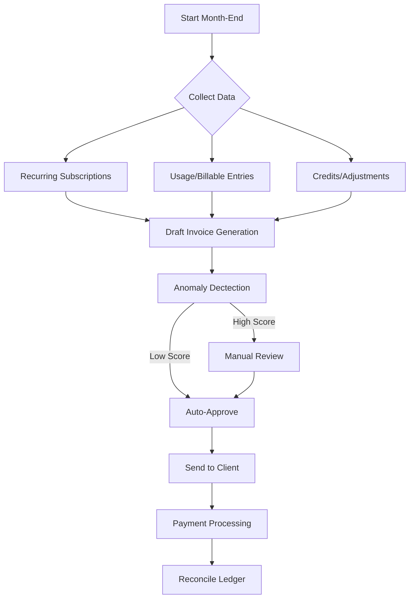

# Persona: Finance Admin
**Role:** The financial controller or office manager responsible for the MSP's cash flow and billing accuracy.

## Primary UI Locations
- **FinOps Dashboard:** `/billing/dashboard` ✅
- **Invoice Management:** `/billing/invoices` ✅
- **Subscription Manager:** `/billing/subscriptions` ✅
- **Reports Center:** `/billing/reports` ✅
- **Pre-Flight Review:** `/billing/pre-flight` ✅
- **Price Overrides:** `/billing/overrides` ✅

## User Stories (Implemented)

### Billing Cycle Management
- ✅ **As a Finance Admin**, I want to **generate all recurring invoices in one click** so that I don't have to manually create 50+ invoices every month.
  - *UI: Pre-Flight Review | Logic: `GenerateMonthlyInvoices` command*
- ✅ **As a Finance Admin**, I want to **review "Draft" invoices before they are sent** so that I can catch errors (like $0 line items) before the client sees them.
  - *UI: Pre-Flight Review with Anomaly Score | Logic: `AnomalyDetectionService`*
- ✅ **As a Finance Admin**, I want to **create client-specific price overrides** so that I can offer custom pricing without changing the global catalog.
  - *UI: Overrides Manager | Logic: `PricingEngineService`*

### Accounts Receivable (AR)
- ✅ **As a Finance Admin**, I want to **see a list of all overdue invoices sorted by age** so that I know who to call first for collections.
  - *UI: Dashboard AR Aging Widget (30/60/90+)*
- ✅ **As a Finance Admin**, I want the system to **automatically send payment reminders** so that I don't have to write awkward emails manually.
  - *Logic: `SendPaymentReminderJob` (3-day, due-date, 7-day, 14-day, 30-day) | UI: ⚠️ No history visibility*
- ✅ **As a Finance Admin**, I want to **record a check payment** against an invoice so that the client's balance is updated immediately.
  - *Logic: `Payment` model | UI: Portal Pay Modal*

### Profitability & Reporting
- ✅ **As a Finance Admin**, I want to **see the Gross Margin per Client** so that I can identify which clients are unprofitable.
  - *UI: Profitability Dashboard | Logic: `AnalyticsService`*
- ✅ **As a Finance Admin**, I want to **see a revenue forecast** so that I can plan for the future.
  - *UI: Dashboard Forecast Chart | Logic: `ForecastingService`*
- ✅ **As a Finance Admin**, I want to **see a line-item breakdown of "Tiered Tickets"** resolved last month, including who requested them and who resolved them, so I can verify the bill before processing.
  - *UI: Invoice Detail View*

### Invoice & Reconciliation
- ✅ **As a Finance Admin**, I want a **single "Unified Invoice"** that clearly separates fixed recurring costs (O365, Support Plans) from variable usage (Dev hours, On-demand tickets), so I can allocate costs.
  - *Logic: `BillingReconciliationService`*
- ✅ **As a Finance Admin**, I want to **receive an automated alert** when a client's monthly "Pre-approved Support Limit" reaches 80%, so I can approve an overage before it disrupts their service.
  - *Logic: `SupportUsageService` Alert*

## Workflows

### Monthly Billing Cycle (Reconciliation)

## Problems Solved
1.  **Revenue Leakage:** Prevents "forgotten" billable hours via Anomaly Detection.
2.  **High DSO:** Reduces time to get paid via automated dunning.
3.  **Manual Drudgery:** Eliminates hours of spreadsheet work with scheduled `GenerateMonthlyInvoices`.
4.  **Cost Transparency:** Unified invoice helps clients understand fixed vs. variable costs.

---

---

## 📋 Phase 12: Bulk Operations & Finance Admin Tools
**Priority:** MEDIUM | **Estimated Effort:** 20-28 hours | **Pattern:** Guided Journey + Control Tower

### Phase Overview
This phase enhances Finance Admin capabilities with bulk operations, advanced reporting, and improved audit visibility. Implements wizard patterns for complex operations and strengthens financial controls.

### User Stories for Phase 12 Implementation

#### Story 12.1: Bulk Price Override Manager
**As a Finance Admin**, I want to **apply a global price increase** (e.g., +5%) to all clients at once so that I can maintain margins after a vendor price hike.

**Implementation Details:**
*   **Route:** `/billing/overrides/bulk`
*   **UX Pattern:** Guided Journey (3-step wizard)
*   **Wizard Steps:**
    1.  **Selection:** Choose clients (all/filtered by tier/specific selection)
    2.  **Configuration:** Set increase type (percentage/flat), amount, effective date
    3.  **Preview:** Review changes with before/after comparison table
*   **Components:**
    *   `x-progress-stepper` for wizard navigation
    *   `x-bulk-preview-table` showing impacted clients
    *   `x-confirmation-modal` requiring typed confirmation ("APPLY CHANGES")
*   **Safety Features:**
    *   Dry-run preview before commit
    *   Audit log of all changes
    *   Rollback capability within 24 hours
*   **Service:** `BulkOverrideService` (new)
    *   Methods: `previewBulkUpdate()`, `applyBulkUpdate()`, `rollback()`

#### Story 12.2: Pre-Flight Excel Export
**As a Finance Admin**, I want to **export the Pre-Flight Review to Excel** so that I can share it with my accountant before approving.

**Implementation Details:**
*   **Location:** Pre-Flight Review page
*   **Button:** "Export to Excel" with loading state
*   **Export Content:**
    *   All draft invoices with anomaly scores
    *   Line item breakdown per invoice
    *   Summary statistics (total AR, anomaly count)
    *   Formatted Excel with multiple sheets
*   **Service:** Existing `ExportService`
    *   New method: `exportPreFlightToExcel()`
*   **File Format:** `.xlsx` with styled headers, frozen panes
*   **Download Behavior:**
    *   Immediate download (< 5 seconds for 100 invoices)
    *   Progress indicator for large exports
    *   Filename: `PreFlight_YYYY-MM-DD.xlsx`

#### Story 12.3: Effective Hourly Rate in Profitability Dashboard
**As a Finance Admin**, I want to **see "Effective Hourly Rate" per client** so that I can compare AYCE contracts to actual labor consumed.

**Implementation Details:**
*   **Location:** `/billing/profitability` dashboard
*   **Display:** New column in client table
*   **Calculation:**
    *   Client Revenue ÷ Client Billable Hours
    *   Compare to company target rate
*   **Visual Treatment:**
    *   Color-coded cells (green: above target, red: below)
    *   Variance percentage shown
    *   Sortable column for quick analysis
*   **Data Source:** Existing `AnalyticsService::calculateEffectiveHourlyRate()`
*   **Performance:** Pre-calculate and cache (hourly refresh)

#### Story 12.4: Enhanced Audit Log Viewer
**As a Finance Admin**, I want to **see a timeline of when dunning emails were sent for a specific invoice** so that I have context before calling a client.

**Implementation Details:**
*   **Location:** Invoice Detail modal → "Activity" tab
*   **Component:** `x-timeline` showing chronological events
*   **Event Types Tracked:**
    *   Invoice created/approved/sent
    *   Payment received/failed
    *   Dunning emails sent (with template name)
    *   Status changes (draft → sent → paid)
    *   Dispute flags raised/resolved
    *   Manual notes added
*   **Visual Design:**
    *   Vertical timeline with icons per event type
    *   Timestamps in user's timezone
    *   User attribution (who performed action)
    *   Expandable details for email content preview
*   **Data Source:** Existing `BillingAuditLog` model
*   **Performance:** Load most recent 50 events, paginate on scroll

#### Story 12.5: Invoice Internal Notes
**As a Finance Admin**, I want to **add internal notes to an invoice** so that my team has context on unusual situations.

**Implementation Details:**
*   **Location:** Invoice Detail modal → "Notes" section
*   **UI Components:**
    *   Text area for note entry
    *   "Add Note" button with loading state
    *   Notes list showing timestamp, author, content
*   **Database:**
    *   Add `internal_notes` JSON field to `invoices` table
    *   Store array of note objects: `{author_id, timestamp, content}`
*   **Permissions:**
    *   Visible only to users with `finance.admin` permission
    *   Not visible to clients in portal
*   **Features:**
    *   Markdown support for formatting
    *   @ mentions for team notifications
    *   Edit/delete capabilities for note author

#### Story 12.6: Dunning Pause Control
**As a Finance Admin**, I want to **pause dunning for a single invoice** (e.g., client disputed it) so that they don't get automated reminders while we resolve the issue.

**Implementation Details:**
*   **Location:** Invoice Detail modal → Action dropdown
*   **UI:**
    *   Toggle switch: "Pause Automated Reminders"
    *   Reason dropdown (Dispute, Payment Plan, Client Request, Other)
    *   Notes field for additional context
*   **Database:**
    *   Add `dunning_paused_at` timestamp to `invoices` table
    *   Add `dunning_pause_reason` enum field
    *   Add `dunning_pause_notes` text field
*   **Logic:**
    *   `SendPaymentReminderJob` checks flag before sending
    *   Visual indicator on invoice list (badge: "Reminders Paused")
    *   Resume option with confirmation
*   **Audit:**
    *   Log pause/resume actions in `BillingAuditLog`
    *   Track who paused and why

---

### Phase 12 Implementation Checklist

#### Backend Tasks
- [ ] Create `BulkOverrideService` for mass price updates
- [ ] Add `exportPreFlightToExcel()` method to `ExportService`
- [ ] Extend `AnalyticsService` to expose EHR per client
- [ ] Add `internal_notes` JSON column to `invoices` table
- [ ] Add dunning pause columns to `invoices` table (`dunning_paused_at`, `dunning_pause_reason`, `dunning_pause_notes`)
- [ ] Update `SendPaymentReminderJob` to check dunning pause flag
- [ ] Create migration for new invoice columns
- [ ] Add rollback logic to `BulkOverrideService`

#### Frontend Tasks
- [ ] Create `/billing/overrides/bulk.blade.php` wizard view
- [ ] Create `x-bulk-preview-table` component
- [ ] Add "Export to Excel" button to Pre-Flight Review
- [ ] Add EHR column to Profitability Dashboard table
- [ ] Create `x-timeline` component for audit log
- [ ] Add "Activity" tab to Invoice Detail modal
- [ ] Add "Notes" section to Invoice Detail modal
- [ ] Add "Pause Dunning" control to Invoice actions
- [ ] Implement markdown rendering for notes
- [ ] Apply semantic color classes (no hardcoded colors)

#### Testing Tasks
- [ ] Unit tests for `BulkOverrideService` calculations
- [ ] Test bulk update preview accuracy
- [ ] Test Excel export with large datasets (1000+ invoices)
- [ ] Feature tests for dunning pause logic
- [ ] Test internal notes CRUD operations
- [ ] Test audit log pagination and filtering
- [ ] Accessibility audit for wizard navigation
- [ ] Test rollback functionality for bulk updates

#### Documentation Tasks
- [ ] Document bulk override workflow and safety features
- [ ] Document Excel export format and sheet structure
- [ ] Create troubleshooting guide for dunning pause issues
- [ ] Document internal notes markdown syntax
- [ ] Document audit log event types and data structure

---

### Success Metrics for Phase 12
*   **Efficiency Gain:** 90% reduction in time to apply global price changes
*   **Adoption:** 60%+ of Finance Admins use Pre-Flight export monthly
*   **Audit Visibility:** 100% of dunning actions tracked in audit log
*   **Error Reduction:** 50% fewer disputes due to better internal notes

---

### Dependencies
*   **Services:** Existing `ExportService`, `AnalyticsService`, `PricingEngineService`
*   **Models:** `Invoice`, `PriceOverride`, `BillingAuditLog`
*   **Libraries:** `league/csv` for Excel export, `spatie/activitylog` for audit trails

---

### Risk Mitigation
*   **Bulk Update Errors:** Implement transaction rollback for failed bulk updates
*   **Data Loss:** Require explicit confirmation before committing bulk changes
*   **Performance:** Queue bulk operations for large datasets (>100 clients)
*   **Audit Integrity:** Use append-only log pattern (no deletion of audit records)

